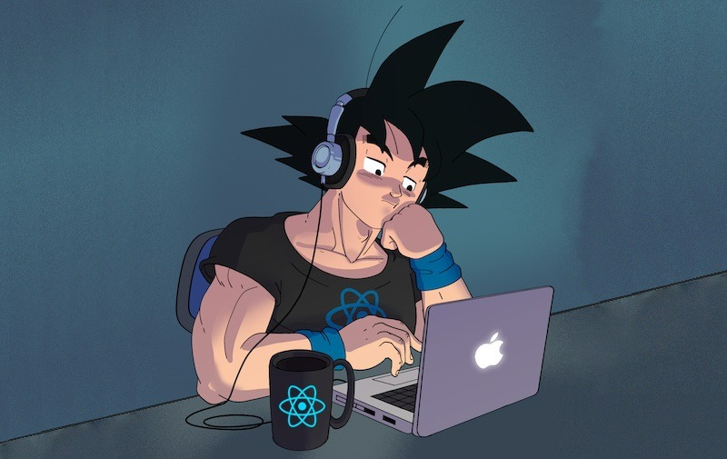

## Oi, Eu sou o Gustavo! 👋

#### Hi, i'm Gustavo and i'm a FullStack Developer 💻.

🧐 &nbsp; My main goal here is to share and help with projects from the community, and contribute to a better community. Right now i'm most focused on the React and Node.js projects.
  🤔 &nbsp; If you need any help with CSS, React, Typescript, NodeJS, GraphQL, i have some experience that may be useful, or maybe just wanna talk about tech and stuff, feel free to reach me.
  ⚛️  &nbsp; My current stack:   

  💬  &nbsp; About me: Besides being passionate about programming and technology in general, i like to play some Valorant once in a while, read mangas, e watch animes e tv shows.
